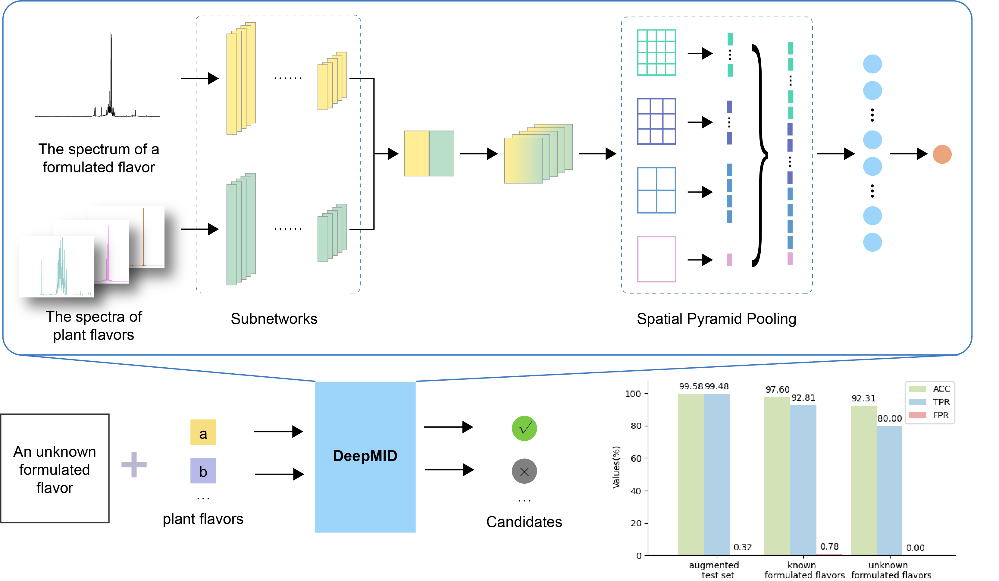

# DeepMID

Nuclear magnetic resonance (NMR) is an unbiased, reproducible, and non-destructive detection method widely used to analyze and characterize complex systems. However, it is challenging to perform mixture identification because of the offset and peak overlap of chemical shifts that often exist in mixtures. Convolutional neural networks have translation invariance and high tolerance to distortion, which are good at extracting local features to solve the above problems well. Here, we propose a deep learning-based mixture identification method (DeepMID) that can be used to identify plant flavors (mixtures) in a formulated flavor (mixture consisting of several plant flavors). This is the code repo for the paper *Deep Learning-based Mixture Identification for Nuclear Mag-netic Resonance Spectroscopy*.



# Installation

Python and TensorFlow:

Python 3.8.13 and TensorFlow (version 2.5.0-GPU)

The main packages can be seen in [requirements.txt](requirements.txt)

- Install Anaconda
  https://www.anaconda.com/


- Install main packages in requirements.txt with following commands

  ```shell
  conda create --name pSCNN python=3.8.13
  conda activate pSCNN
  python -m pip install -r requirements.txt
  pip install tqdm
  ```


# Clone the repo and run it directly

```shell
git clone https://github.com/yfWang01/DeepMID.git
```

# Download the model and run directly


**Training your model and predict mixture spectra data**

Run the file 'DeepMID.py'. Download the [model](model/) and these [example data](data/), DeepMID can be reload and predict easily.

# Contact

Yufei Wang: 222311036@csu.edu.cn
